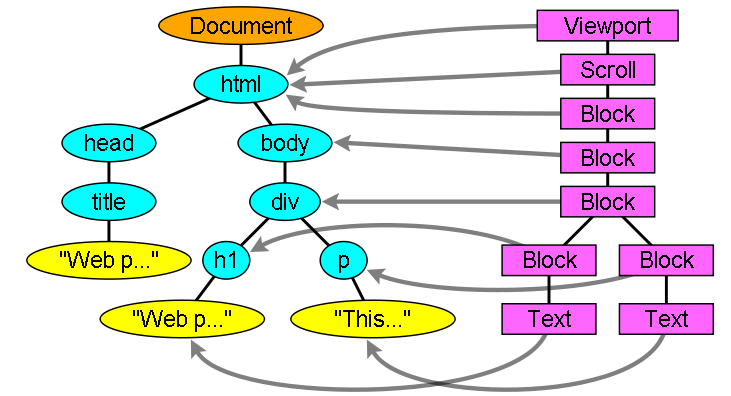

## 编程语言的 DSL 与 AST

### DSL 是什么

> A specialized computer language designed for a specific task.

DSL 其实是 Domain Specific Language 的缩写，中文翻译为领域特定语言（下简称 DSL）；而与 DSL 相对的就是 GPL，这里的 GPL 并不是我们知道的开源许可证，而是 General Purpose Language 的简称，即通用编程语言，也就是我们非常熟悉的 Objective-C、Java、Python 以及 C 语言等等。

最常见的 DSL 包括 Regex 以及 HTML & CSS，在这里会对这几个例子进行简单介绍

1. Regex
   正则表达式仅仅指定了字符串的 pattern，其引擎就会根据 pattern 判断当前字符串跟正则表达式是否匹配。regex
2. SQL
   SQL 语句在使用时也并没有真正的执行，我们输入的 SQL 语句最终还要交给数据库来进行处理，数据库会从 SQL 语句中读取有用的信息，然后从数据库中返回使用者期望的结果。
3. HTML & CSS
   HTML 和 CSS 只是对 Web 界面的结构语义和样式进行描述，虽然它们在构建网站时非常重要，但是它们并非是一种编程语言，正相反，我们可以认为 HTML 和 CSS 是在 Web 中的领域特定语言。

#### 构建 DSL

DSL 的构建与编程语言其实比较类似，想想我们在重新实现编程语言时，需要做那些事情；实现编程语言的过程可以简化为定义语法与语义，然后实现编译器或者解释器的过程，而 DSL 的实现与它也非常类似，我们也需要对 DSL 进行语法与语义上的设计。

实现 DSL 总共有这么两个需要完成的工作：

- 设计语法和语义，定义 DSL 中的元素是什么样的，元素代表什么意思
- 实现 parser，对 DSL 解析，最终通过解释器来执行
  以 HTML 为例，HTML 中所有的元素都是包含在尖括号 <> 中的，尖括号中不同的元素代表了不同的标签，而这些标签会被浏览器解析成 DOM 树，再经过一系列的过程调用 Native 的图形 API 进行绘制。



### AST

> 在计算机科学中，抽象语法树（abstract syntax tree 或者缩写为 AST），或者语法树（syntax tree），是源代码的抽象语法结构的树状表现形式，这里特指编程语言的源代码。树上的每个节点都表示源代码中的一种结构。之所以说语法是「抽象」的，是因为这里的语法并不会表示出真实语法中出现的每个细节。

计算机编程语言上，无论什么语种，都会有「类型」「运算符」「流程语句」「函数」「对象」等概念来表达计算机中存在内存中的 0 和 1，以及背后运算与逻辑。
不同的语言，都会配之不同的语法分析器，而语法分析器是把源代码作为字符串读入、解析，并建立语法树的程序。语法的设计和语法分析器的实现是决定语言外在表现的重要因素。

词法分析->语法分析->AST 抽象语法树

语法分析器：

1. 确定语法定义
2. 扫描分词结果
3. 根据语法定义，转换成 AST

#### JavaScript 的语法树

如

```js
const a = 5
```

```json
{
  "type": "VariableDeclaration",
  "declarations": [
    {
      "type": "VariableDeclaration",
      "kind": "const",
      "id": {
        "type": "Identifier",
        "name": "a"
      },
      "init": {
        "type": "Literal",
        "value": 5
      }
    }
  ]
}
```

### 手写 CSS 解析器

CSS 语法：

```
-选择器
    -声明
      -属性
      -值
```

```js
/**
 * +? *? 最小匹配模式， 即偷懒模式
 * + * 默认贪婪模式
 */
let cssGramaRule = /([\s\S]+?)\{([\s\S]*?)\s*?\}/gi
let css = `
.foo{
  color:red;
  left:10px;
}
body{
  background:green;
}
`
css = css.replace(/[\s\n]/g, '')
console.log()

let matchRule = {}
let rules = []

while ((matchRule = cssGramaRule.exec(css))) {
  console.log('matchRule:', matchRule)
  rules.push({
    selector: matchRule[1],
    style: parseProperty(matchRule[2]),
    cssText: matchRule[0]
  })
}

console.log('rules:', rules)

function parseProperty(expr) {
  let exprList = expr.split(';')
  let result = {}
  exprList.forEach(item => {
    if (item.match(':')) {
      let kv = item.split(':')
      result[kv[0]] = kv[1]
    }
  })

  return result
}
```

### Babel 原理

相关工具：

- ES6 Code -Acorn 解析
- Parse AST -BabaIon/esprima 生成 AST
- Transform AST -Babel-traverse 转换
- Generate ES5 Code -Babel-generator 生成代码

Babel 的三个主要处理步骤分别是： 解析（parse），转换（transform），生成（generate）。

#### 解析

解析步骤接收代码并输出 AST。 这个步骤分为两个阶段：**词法分析（Lexical Analysis） **和 语法分析（Syntactic Analysis）。

1. 词法分析
   词法分析阶段把字符串形式的代码转换为 令牌（tokens） 流。

你可以把令牌看作是一个扁平的语法片段数组：

```
n * n;
```

```
[
{ type: { ... }, value: "n", start: 0, end: 1, loc: { ... } },
{ type: { ... }, value: "*", start: 2, end: 3, loc: { ... } },
{ type: { ... }, value: "n", start: 4, end: 5, loc: { ... } },
...
]

```

每一个 type 有一组属性来描述该令牌：

```js
{
    type: {
        label: 'name',
        keyword: undefined,
        beforeExpr: false,
        startsExpr: true,
        rightAssociative: false,
        isLoop: false,
        isAssign: false,
        prefix: false,
        postfix: false,
        binop: null,
        updateContext: null
    },
    ...
}
```

和 AST 节点一样它们也有 start，end，loc 属性。

2. 语法分析
   语法分析阶段会把一个令牌流转换成 AST 的形式。 这个阶段会使用令牌中的信息把它们转换成一个 AST 的表述结构，这样更易于后续的操作。

#### 转换

转换步骤接收 AST 并对其进行遍历，在此过程中对节点进行添加、更新及移除等操作。 这是 Babel 或是其他编译器中最复杂的过程 同时也是插件将要介入工作的部分。

#### 生成

代码生成步骤把最终（经过一系列转换之后）的 AST 转换成字符串形式的代码，同时还会创建源码映射（source maps）。

代码生成其实很简单：深度优先遍历整个 AST，然后构建可以表示转换后代码的字符串。

参考：
https://draveness.me/dsl

http://jartto.wang/2018/11/17/about-ast/

https://github.com/jamiebuilds/babel-handbook/blob/master/translations/zh-Hans/plugin-handbook.md#toc-asts

https://github.com/estree/estree
