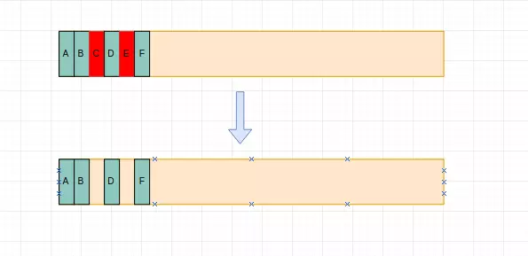
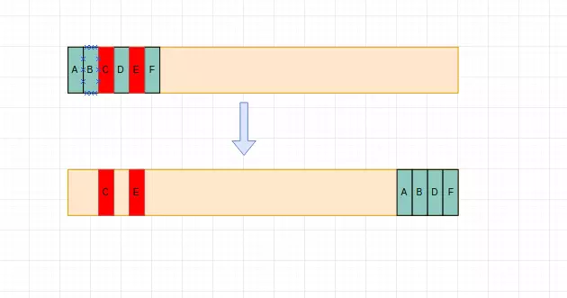

## 数据类型

### 基础数据类型

- null
  - typeof 返回'object'，这是一个遗留的 bug： 在 JS 的最初版本中使用的是 32 位系统，为了性能考虑使用低位存储变量的类型信息，000 开头的是对象，null 是全 0，所以将 null 误判为 object
- undefined
- Boolean
  - [占 4 个字节](https://262.ecma-international.org/5.1/)
- String
  - 字符串的内部格式始终是  UTF-16，即：每个字符都有对应的数字代码。可以用 charCodeAt 查看
  - UTF-16 编码中，一个英文字母字符或一个汉字字符存储都需要**2 个字节**（2\*8bit）（Unicode 扩展区的一些汉字存储需要 4 个字节
- Number
  - 双精度 IEEE 754 64 位浮点，**8 个字节**
  - 整数类型表示范围：`-2^53`到`2^53`，超过范围无法精确表示
- BigInt
  - 任意精度数字类型，已经进入 stage3 规范
  - 整数字面量后面加  `n`，或者调用 BigInt
  - 支持`+`、`*`、`-`、`**`、`%`，`/`  操作符会向零取整
  - BigInt 和 Number 不是严格相等的，但是宽松相等的。
  - typeof 返回'bigint'
  - toString 方法返回以指定基数(base)表示指定数字的字符串
  - 不能被 JSON.stringify 序列化
- Symbol
  - typeof 返回 'symbol'
  - 表示唯一值
  - 用来作为对象属性的标识符，获取 symbol 属性：Object.getOwnPropertySymbols()
  - for...in、Object.getOwnPropertyNames 不可枚举对象的 symbol 属性
  - 当使用  `BigInt`  时，带小数的运算会被取整，如 5n / 2n 结果为 2n

#### 计算变量所占内存大小

使用 object-sizeof 计算：
https://github.com/miktam/sizeof/blob/master/index.js

#### 包装对象

当基本字符串、布尔值等基本值需要调用一个对应对象才有的方法或者查询值的时候(基本字符串是没有这些方法的)，JavaScript 会自动将基本值转化为对象并且调用相应的方法或者执行查询，转化后的对象就是包装对象。

#### parseInt

parseInt() 函数解析一个字符串参数，并返回一个指定基数的整数 (数学系统的基础)。

```js
const intValue = parseInt(string[, radix]);
```

- string 要被解析的值。如果参数不是一个字符串，则将其转换为字符串(使用 ToString 抽象操作)。字符串开头的空白符将会被忽略。
- radix 一个介于 2 和 36 之间的整数(数学系统的基础)，表示上述字符串的基数。默认为 10。
- 返回值 返回一个整数或 NaN

注意：
在 radix 为 undefined，或者 radix 为 0 或者没有指定的情况下，JavaScript 作如下处理：

- 如果字符串 string 以"0x"或者"0X"开头, 则基数是 16 (16 进制).
- 如果字符串 string 以"0"开头, 基数是 8（八进制）或者 10（十进制），那么具体是哪个基数由实现环境决定。ECMAScript 5 规定使用 10，但是并不是所有的浏览器都遵循这个规定。因此，永远都要明确给出 radix 参数的值。
- 如果字符串 string 以其它任何值开头，则基数是 10 (十进制)。

### 对象

#### 对象的属性

ECMAScript 将对象的属性分为两种：数据属性和访问器属性。
然后根据具体的上下文环境的不同，我们又可以将属性分为：原型属性和实例属性。

#### 数据属性（Data Properties）

数据属性有 4 个描述其行为的特性：

- [[Configurable]]: 表示能否通过 delete 删除属性从而重新定义属性，能否修改属性的特性，或者能否把属性修改为访问器属性。
- [[Enumerable]]: 表示能否通过 for-in 循环返回属性。
- [[Writable]]: 表示能否修改属性的值。
- [[Value]]: 包含这个属性的数据值。读取属性值的时候，从这个位置读；写入属性值时，把新值保存在这个位置。默认值是 undefined。

注意：
直接在对象上定义属性， [[Configurable]]、[[Enumerable]] 和 [[Writable]] 特性默认都被设置为 true，而 [[Value]] 特性被设置为指定的值。
而直接通过 Object.defineProperty() 为对象添加属性以及值，这种情况下，这个对象的这个属性的另外 3 个特性的默认值都是 false。

#### 访问器属性（Accessor Properties）

访问器属性有如下 4 个特性：

- [[Configurable]]：表示能否通过 delete 删除属性从而重新定义属性，能否修改属性的特性，或者能否把属性修改为数据属性。
- [[Enumerable]]：表示能否通过 for-in 循环返回属性。
- [[Get]]：在读取属性时调用的函数。默认值为 undefined。
- [[Set]]：在写入属性时调用的函数。默认值为 undefined。

访问器属性不能直接定义，必须使用 Object.defineProperty() 来定义。

#### Object.keys 、for...in、 Object.getOwnPropertyNames

- for...in 语句以任意顺序遍历一个对象的除 Symbol 以外的可枚举属性，包括继承的可枚举属性。
  - 其实 for...in 操作的主要目的就是遍历对象的属性，如果只需要获取对象的实例属性，可以使用 hasOwnProperty()进行过滤。
  - 遍历顺序：事实上，它不一定根据定义时的顺数输出，所有浏览器的最新版本现在都按 chrome 执行，先把当中的非负整数键提出来，排序好输出，然后将剩下的定义时的顺序输出。
- Object.keys()用于获取对象自身所有的可枚举的属性值，但不包括原型中的属性，然后返回一个由属性名组成的数组。注意它同 for..in 一样不能保证属性按对象原来的顺序输出。

- Object.getOwnPropertyNames()方法返回对象的所有自身属性的属性名（包括不可枚举的属性）组成的数组，但不会获取原型链上的属性。
- Object.getOwnPropertySymbols, 遍历原型链获取 Symbol 属性: Object.getOwnPropertySymbols(Object.getPrototypeOf(obj))

注意：

- 若扩展了原生的 Array，for...in 遍历数组会输出扩展属性

- for..in 遍历数组它自动过滤掉了不存在的元素，但是对于存在的元素且值为 undefined 或者'null'仍然会有效输出

```js
var colors = ['red', 'green', 'blue'];
// 将数组长度变为10
colors.length = 10;
// 再添加一个元素的数组末尾
colors.push('yellow');

for (var i in colors) {
  console.log(i); // 0 1 2 10
}
```

#### for in 遍历顺序

标准参考
根据 ECMA-262（ECMAScript）第三版中描述，for-in 语句的属性遍历的顺序是由对象定义时属性的书写顺序决定的。

在现有最新的 ECMA-262（ECMAScript）第五版规范中，对 for-in 语句的遍历机制又做了调整，属性遍历的顺序是没有被规定的。

新版本中的属性遍历顺序说明与早期版本不同，这将导致遵循 ECMA-262 第三版规范内容实现的 JavaScript 解析引擎在处理 for-in 语句时，与遵循第五版规范实现的解析引擎，对属性的遍历顺序存在不一致的问题。

Chrome Opera 中使用 for-in 语句遍历对象属性时会遵循一个规律，它们会先提取所有 key 的 parseFloat 值为非负整数的属性， 然后根据数字顺序对属性排序首先遍历出来，然后按照对象定义的顺序遍历余下的所有属性。其它浏览器则完全按照对象定义的顺序遍历属性。

参考：
https://www.cnblogs.com/wujie520303/p/4931384.html
https://javascript.info/object#ordered-like-an-object

#### new

new 的作用:

- 创建一个新对象 obj
- 把 obj 的**proto**指向 构造函数原型 实现继承
- 执行构造函数，传递参数，改变 this 指向
- 最后把 obj 返回

```js
function _new() {
  let constructor = Array.prototype.shift.call(arguments);
  let args = arguments;
  const obj = new Object();
  obj.__proto__ = constructor.prototype;
  constructor.call(obj, ...args);
  return obj;
}
```

### Map Set

#### Set

ES6 提供了新的数据结构 Set。它类似于数组，但是成员的值都是唯一的，没有重复的值。

#### WeakSet

WeakSet 的成员只能是对象，而不能是其他类型的值。
WeakSet 中的对象都是弱引用，即垃圾回收机制不考虑 WeakSet 对该对象的引用，也就是说，如果其他对象都不再引用该对象，那么垃圾回收机制会自动回收该对象所占用的内存，不考虑该对象还存在于 WeakSet 之中。

WeakSet 结构有以下三个方法。

- WeakSet.prototype.add(value)：向 WeakSet 实例添加一个新成员。
- WeakSet.prototype.delete(value)：清除 WeakSet 实例的指定成员。
- WeakSet.prototype.has(value)：返回一个布尔值，表示某个值是否在 WeakSet 实例之中。

#### Map

Object 只能用字符串当作键
Map 键的范围不限于字符串，各种类型的值（包括对象）都可以当作键。

Map 结构原生提供三个遍历器生成函数和一个遍历方法。

- Map.prototype.keys()：返回键名的遍历器。
- Map.prototype.values()：返回键值的遍历器。
- Map.prototype.entries()：返回所有成员的遍历器。
- Map.prototype.forEach()：遍历 Map 的所有成员。

#### WeakMap

- WeakMap 只接受对象作为键名（null 除外），不接受其他类型的值作为键名
- WeakMap 的键名所指向的对象，不计入垃圾回收机制，
  键名所引用的对象都是弱引用，即垃圾回收机制不将该引用考虑在内。因此，只要所引用的对象的其他引用都被清除，垃圾回收机制就会释放该对象所占用的内存。也就是说，一旦不再需要，WeakMap 里面的键名对象和所对应的键值对会自动消失，不用手动删除引用。
- WeakMap 弱引用的只是键名，而不是键值。键值依然是正常引用。

```js
let myElement = { key: 1 };
let wm = new WeakMap();

wm.set(myElement, { timesClicked: 0 });
myElement = null;
// 强制垃圾回收后 wm为空
console.log(wm);
```

总结
Set

- 成员唯一、无序且不重复
- [value, value]，键值与键名是一致的（或者说只有键值，没有键名）
- 可以遍历，方法有：add、delete、has

WeakSet

- 成员都是对象
- 成员都是弱引用，可以被垃圾回收机制回收，可以用来保存 DOM 节点，不容易造成内存泄漏
- 不能遍历，方法有 add、delete、has

Map

- 本质上是键值对的集合，类似集合,键类型可以是任意的
- 可以遍历，方法很多可以跟各种数据格式转换

WeakMap

- 只接受对象作为键名（null 除外），不接受其他类型的值作为键名
- 键名是弱引用，键值可以是任意的，键名所指向的对象可以被垃圾回收，此时键名是无效的
- 不能遍历，方法有 get、set、has、delete

#### WeakRef

WeakSet 和 WeakMap 是基于弱引用的数据结构，ES2021 更进一步，提供了 WeakRef 对象，用于直接创建对象的弱引用。
https://es6.ruanyifeng.com/#docs/set-map

#### FinalizationRegistry

ES2021 引入了清理器注册表功能 FinalizationRegistry，用来指定目标对象被垃圾回收机制清除以后，所要执行的回调函数。

## 函数

### 执行栈

js 的运行有三种环境：

- Global Code, JavaScript 代码开始运行的默认环境
- Function Code, 代码进入一个 JavaScript 函数
- Eval Code, 使用 eval()执行代码

为了表示不同的运行环境，JavaScript 中有一个执行上下文（Execution context，EC）的概念。也就是说，当 JavaScript 代码执行的时候，会进入不同的执行上下文，这些执行上下文就构成了一个执行上下文栈（Execution context stack，ECS）。

执行上下文有三个重要的属性:

- 变量对象（Variable object，VO）,进入一个执行上下文时被激活（Activation object，AO）
- 作用域链（Scope chain）
- this

#### 解释器执行代码的伪逻辑

1.  查找调用函数的代码
2.  执行代码之前，先进入创建上下文阶段
    - 分析形参
    - 扫描上下文的函数声明
      - 为发现的每一个函数，在变量对象上创建一个属性——确切的说是函数的名字——其有一个指向函数在内存中的引用
      - 如果函数的名字已经存在，引用指针将被重写
    - 扫描上下文的变量声明
      - 为发现的每个变量声明，在变量对象上创建一个属性——就是变量的名字，并且将变量的值初始化为 undefined
      - 如果变量的名字已经在变量对象里存在，将不会进行任何操作并继续扫描。
    - 求出上下文内部“this”的值。
3.  执行代码阶段
    - 在当前上下文上运行/解释函数代码，并随着代码一行行执行指派变量的值。

#### AO

VO/AO 代表局部作用域,
VO 对应伪逻辑第二阶段，AO 对应第三阶段。

#### GO

GO 代表全局作用域

### 作用域链 [[Scopes]]

[[Scopes]] 是一个链式数组结构：[AO1,AO2,...,GO],最前端是当前函数的活动对象 AO。

对于自由变量，即当前作用域中没有定义的变量，需要向父级作用域寻找（AO2）,
如果父级中没有找到，则再一层一层向上查找，直到全局作用域。这种一层一层间的关系，就是作用域链。

注意：自由变量的查找依据的是函数定义时的作用域，而不是执行时的作用域,例如闭包。

### 词法环境

在 JavaScript 中，每个运行的函数，代码块  `{...}` （包括 eval、with、catch）以及整个脚本，都有一个被称为  **词法环境（Lexical Environment）**   的内部（隐藏）的关联对象。

词法环境对象由两部分组成：

- **1：环境记录（Environment Record）** ，这个就是真正登记变量的地方。

  - **1.1：声明式环境记录（Declarative Environment Record）** ：用来记录直接有标识符定义的元素，比如变量、常量、let、class、module、import 以及函数声明。
  - **1.2：对象式环境记录（Object Environment Record）** ：主要用于 with 和 global 的词法环境。

- **2：对外部词法环境的引用（outer）** ，它是作用域链能够连起来的关键。

一个“变量”只是  **环境记录**  这个特殊的内部对象的一个属性。“获取或修改变量”意味着“获取或修改词法环境的一个属性”。

#### 内部词法环境和 外部词法环境

在一个函数运行时，在调用刚开始时，会自动创建一个新的词法环境以存储这个调用的局部变量和参数。
在这个函数调用期间，我们有两个词法环境：内部一个（用于函数调用）和外部一个（全局）：

- 内部词法环境与   函数的当前执行相对应。
- 外部词法环境是全局词法环境。

### 代码执行流程

引擎在执行代码的步骤如下：

- 1：创建一个新的**执行上下文（Execution Context）**
- 2：创建一个新的**词法环境（Lexical Environment）**
- 3：把**LexicalEnvironment**和**VariableEnvironment**指向新创建的词法环境
- 4：把这个执行上下文压入**执行栈**并成为**正在运行的执行上下文**
- 5：执行代码
- 6：执行结束后，把这个执行上下文弹出执行栈

### 闭包

闭包的解释：

- 一个函数和对其周围状态（**lexical environment，词法环境**）的引用捆绑在一起（或者说函数被引用包围），这样的组合就是**闭包**（**closure**）。
- 闭包是指内部函数总是可以访问其所在的外部函数中声明的变量和参数，即使在其外部函数被返回（寿命终结）了之后。
- 闭包就是指：执行完的`执行上下文`被弹出执行栈，它的词法环境处于失联状态，后续的执行上下文没办法直接访问这个失联的词法环境。在闭包这种情况下还保留了对那个词法环境的`引用`，从而可以通过这个`引用`去访问失联的词法环境，这个`引用`就是闭包。

### 原型

#### instanceof

- `instanceof`  的内部机制是通过判断对象的原型链中是不是能找到类型的  `prototype`。
- `instanceof`  只能用来判断对象类型，原始类型不可以。并且所有对象类型 instanceof Object 都是 true。
- instanceof 是判断类型的 prototype 是否出现在对象的原型链中，但是对象的原型可以随意修改，所以这种判断并不准确。

```
[]  instanceof Array; // true
[]  instanceof Object; // true
```

```
const obj = {}
Object.setPrototypeOf(obj, Array.prototype)
obj instanceof Array // true
```

### 内存

#### 内存的生命周期

- 内存分配：声明变量、函数、对象的时候，js 会自动分配内存。
- 内存的使用：调用的时候，使用的时候
- 内存的回收

#### 垃圾回收机制

##### 引用计数

定义：清除无引用的对象
a 对象对 b 对象有访问权限，那么成为 a 引用 b 对象。
引用计数法会有缺点，对于循环引用的对象，无法回收。

##### 标记清除算法

定义：清除无法达到的对象

1. 在运行的时候给存储在内存的所有变量加上标记
2. 从根部出发，能触及的对象，把标记清除
3. 有标记的变量被视为即将要删除的变量

##### 内存泄漏场景

1. 全局变量
2. 定时器和回调函数
3. 闭包
4. dom 引用

```
const elements={
    image:document.getElementById('image')
}
// 移除dom后elements.image的引用还存在内存当中
document.body.removeChild(document.getElementById('image'))
// clear
elements.image=null
```

##### 计算变量占用内存的大小

```
// 1. key、value都需要计算
// 2. 同一引用不重复计算
const seen = new WeakSet();
function sizeOfObject(object){
    if(object===null) return 0
    let bytes=0
    const properties=Object.keys(object)
    for(let i=0;i<properties.length;i++){
        const key =properties[i]
        if(typeof object[key] === 'object' && object[key] !===null){
            if(seen.has(object[key])) continue;
            seen.add(object[key])
        }
        bytes+=calculator(key)
        bytes+=calculator(object[key])
    }
    return bytes;
}
// 每个字符占2byte number:8byte boolean:4byte
function calculator(object){
    const objectType = typeof object
    switch(objectType){
        case 'string':
            return object.length*2
        case 'number':
            return 8; // 64位，8字节
        case 'boolean':
            return 4
        case 'object':{
            if(Array.isArray(object)){
                return object.map(calculator).reduce((res,val)=>res+val),0)
            }else{
                return sizeOfObject(object)
            }
        }
        default:
            return 0;
    }
}
```

### V8 引擎内存管理

- 新生代内存空间（64 位 OS 下大小限制为 64MB）
  - semi space Form
  - semi space To
- 老生代内存空间（64 位 OS 下大小限制为 1400MB）

#### 内存大小

和操作系统有关 64 位 OS 下,内存大小限制为 1.4GB,
新生代内存空间大小限制为 64MB,
老生代内存空间大小限制为 1400MB

由于以下原因，js 内存设计不会太大：

- 内存不会持久化，执行后进行回收；
- 回收内存时，js 暂停执行，
  回收一次 100mb，需要暂停 6ms

#### 内存大小调整

V8 提供选择来调整内存大小的配置，需要在初始化时候配置生效，遇到 Node 无法分配足够内存给 JS 对象的情况，可以用如下办法来放宽 V8 默认内存限制。避免执行过程内存用的过多导致崩溃

```sh
node --max-old-space-size=1700 index.js
node --max-new-space-size=1024 index.js
```

#### V8 垃圾回收算法

在 V8 中，主要将内存分为新生代和老生代，新生代的对象为存活时间较短的对象，老生代的对象为存活时间较长或常驻内存的对象，

1. 新生代简单的说就是复制

新生代内存空间用来存储新产生的变量,变量小，存在时间短

- 变量先存储在 From 空间里，满足一定条件后发生回收
- 将 From 空间中活着的变量复制到 To 空间中
- 然后清空 From 空间
- 下一次发生回收时 From 和 To 对调

这种复制算法即 Cheney 算法：

> Cheney 算法是一种采用复制的方式实现的垃圾回收算法。它将堆内存一分为二，每一部分空间称为 semispace。在这两个 semispace 空间中，只有一个处于使用中，另一个处于闲置状态。处于使用状态的 semispace 空间称为 From 空间，处于闲置状态的空间称为 To 空间。当我们分配对象时，先是在 From 空间中进行分配。当开始进行垃圾回收时，会检查 From 空间中的存活对象，这些存活对象将被复制到 To 空间中，而非存活对象占用的空间将会被释放。完成复制后，From 空间和 To 空间的角色发生兑换。简而言之，在垃圾回收过程中，就是通过将存活对象在两个 semispace 空间之间进行复制。

型的牺牲空间换取时间的算法，内存中有一半空间始终是空闲的,新生代中对象的生命周期较短，恰恰适合这个算法。

2. 老生代标记删除整理

- 标记未使用的空间
- 删除标记的空间
- 删除后内存空间会产生空隙，需要进行整理使空间连续（数组需要连续的空间存储）

Mark Sweep:

Mark Sweep 是将需要被回收的对象进行标记，在垃圾回收运行时直接释放相应的地址空间



Mark Compact:

Mark Compact 的思想有点像新生代垃圾回收时采取的 Cheney 算法：将存活的对象移动到一边，将需要被回收的对象移动到另一边，然后对需要被回收的对象区域进行整体的垃圾回收。



#### 新生代晋升到老生带

实际使用的堆内存是新生代的两个 semispace 空间大小和老生代所用内存大小之和。当一个对象经过多次复制依然存活时，它将会被认为是生命周期较长的对象。这种较长生命周期的对象随后会被移动到老生代中，采用新的算法进行管理。对象从新生代中移动到老生代中的过程称为 **晋升**。

对象晋升的条件主要有两个，一个是对象是否经历过 Scavenge 回收，一个是 To 空间的内存占用比超过限制。

1. 变量是否经历过回收？

- 是，进入老生代
- 否，进入 To 空间

2. To 空间是否已经使用 25%（8MB）？

- 是，进入老生代
- 否，进入 To 空间

#### 使用 node 查看内存使用情况

- process.memoryUsage()

```
// 单位 byte
{
   rss: 23273472,
  heapTotal: 9682944,
  heapUsed: 5391304,
  external: 8874
}
```

#### V8 中的变量

- 内存主要就是存储变量等数据的

JS 声明变量并赋值时，所使用对象的内存就分配在堆中。如果已申请的堆空闲内存不够分配新的对象，将继续申请堆内存，直到对的大小超过 V8 的限制为止。

变量分为局部变量和全局变量，这两者的回收方式有差异

- 局部变量当程序执行结束，且没有引用的时候就会随着消失
  - 局部变量会回收，只是说可以回收，并不是用完立即回收
- 全局对象会始终存活到程序运行结束

内存溢出例子

```js
const size = 100 * 1024 * 1024;

let arrobj = {};

for (let i = 0; i < 10; i++) {
  arrobj[i] = new Array(size);
}

console.log('done');
```

参考：
https://github.com/zqjflash/nodejs-memory
https://www.jianshu.com/p/455d0b9ef0a8

### 异步编程

#### 浏览器事件循环

1. 一般来说首次执行的宏任务就是解析页面 html 和引入的 js 脚本。

2. 整体流程：

- 从宏队列中队首任务推入主执行栈。
- 宏任务执行过程中遇到微任务，则需要将微任务添加到微队列中。
- 主执行栈中宏任务执行完毕后，微队列中的所有任务会推入到主执行栈中，依次执行。
- 主执行栈中的所有微任务执行完成后，开始检查渲染，渲染线程接管资源，js 主线程挂起。
- 渲染完毕后，渲染线程挂起，js 主线程接管资源，再次重复整个过程。

3. 一次 tick 只能执行一个宏任务，但是可以执行多个微任务，这样可以避免不必要的 UI 重绘

常见的 macro task 有 setTimeout、MessageChannel、postMessage、setImmediate；常见的 micro task 有 MutationObsever 和 Promise.then。

参考：
https://zhuanlan.zhihu.com/p/96958260

#### Promise

##### Promise 简单实现

Promise A+ 规范：
https://promisesaplus.cn/

```js
let PADDING = 'PADDING',
  FULFILLED = 'FULFILLED',
  REJECTED = 'REJECTED';
class Promise {
  static status;
  result;
  resolvedCallbacks = [];
  rejectedCallbacks = [];
  constructor(fn) {
    this.status = PADDING;

    try {
      fn(this.resolve.bind(this), this.reject.bind(this));
    } catch (e) {
      this.reject(e);
    }
  }
  // 当promise处于pending时 promise可以转为fulfilled或rejected状态
  resolve(res) {
    setTimeout(() => {
      if (this.status === PADDING) {
        this.status = FULFILLED;
        this.result = res;
        this.resolvedCallbacks.forEach((fn) => {
          fn(res);
        });
      }
    });
  }
  reject(err) {
    setTimeout(() => {
      if (this.status === PADDING) {
        this.status = REJECTED;
        this.result = err;
        this.rejectedCallbacks.forEach((fn) => {
          fn(err);
        });
      }
    });
  }
  then(onFulfilled, onRejected) {
    return new Promise((resolve, reject) => {
      if (this.status === PADDING) {
        this.resolvedCallbacks.push(onFulfilled);
        this.rejectedCallbacks.push(onRejected);
      } else if (this.status === FULFILLED) {
        setTimeout(() => {
          try {
            this.result = onFulfilled();
          } catch (e) {
            onRejected(e);
          }
        });
      } else if (this.status === REJECTED) {
        setTimeout(() => {
          onRejected(this.result);
        });
      }
    });
  }
}
let p = new Promise((resolve, reject) => {
  console.log('created promise');
  setTimeout(() => {
    resolve('1');
    console.log('setTimeout called');
  });
});
p.then(
  (res) => {
    console.log('then resolved', res);
  },
  (err) => {
    console.log('then rejected', err);
  }
);
console.log('executed');
```

##### Promise 顺序执行

for 循环、reduce 等可以实现 p.then().then()...从而完成 Promise 顺序执行

##### Promise 限制并发

```
// func promise函数列表
// limit 并发数
function limitTask(...tasks,limit){
    const sequence=[...tasks]
    let promises=sequence.splice(0,limit).map((task,index)=>task().then(()=>index))
    let p =Promise.race(promises)
    // for实现p.then().then()...
    for(let i=0;i<sequence.length;i++){
        p=p.then(index=>{
            promise[index]=sequence[i].then(()=>index)
            return Promise.race(promises)
        })
    }

}
```

#### async 函数

async 是 Generator 函数的语法糖
和 Generator 相比，async 函数的有点：

- 内置执行器。
- 更好的语义
- 更广的适用性，async 函数的 await 命令后面，可以是 Promise 对象和原始类型的值（数值、字符串和布尔值，但这时会自动转成立即 resolved 的 Promise 对象）。
- 返回值是 Promise

##### 返回 Promise 对象

async 函数返回一个 Promise 对象。

async 函数内部 return 语句返回的值，会成为 then 方法回调函数的参数。

##### Promise 对象的状态变化

async 函数返回的 Promise 对象，必须等到内部所有 await 命令后面的 Promise 对象执行完，才会发生状态改变，除非遇到 return 语句或者抛出错误。也就是说，只有 async 函数内部的异步操作执行完，才会执行 then 方法指定的回调函数。

#### await 命令

正常情况下，await 命令后面是一个 Promise 对象，返回该对象的结果。如果不是 Promise 对象，就直接返回对应的值。
另一种情况是，await 命令后面是一个 thenable 对象（即定义了 then 方法的对象），那么 await 会将其等同于 Promise 对象。

##### 注意

async 函数可以保留运行堆栈

```js
const a = async () => {
  await b();
  c();
};
```

上面代码中，b()运行的时候，a()是暂停执行，上下文环境都保存着。一旦 b()或 c()报错，错误堆栈将包括 a()。

### 微任务-MutationObserver

MutationObserver 接口提供了监视对 DOM 树所做更改的能力。它被设计为旧的 Mutation Events 功能的替代品，该功能是 DOM3 Events 规范的一部分。

```js
function microFn(callback) {
  // 创建一个观察器实例并传入回调函数
  let observer = new MutationObserver((mutationsList, observer) => {
    //console.log('MutationObserver callback',mutationsList,observer)
    callback && callback();
    observer.disconnect();
  });
  let targetNode = document.createElement('div');
  // 以上述配置开始观察目标节点
  observer.observe(targetNode, { attributes: true, childList: true, subtree: true });
  targetNode.innerText = '1';
  targetNode = null;
}
microFn(() => {
  console.log('microFn callback');
});
console.log('microFn end');
```

## 模块

### CommonJS

Node.js 应用由模块组成，每个文件就是一个模块，有自己的作用域。在一个文件里面定义的变量、函数、类，都是私有的，对其他文件不可见。每个模块内部有两个变量可以使用，`require`  和  `module`。

- `require`  用来加载某个模块；
  - 第一次加载某个模块时，Node.js 会缓存该模块。以后再加载该模块，就直接从缓存取出该模块的  `module.exports`  属性返回了
  - CommonJS 模块的加载机制是，`require`  的是被导出的值的拷贝。也就是说，一旦导出一个值，模块内部的变化就影响不到这个值 。
- `module`  代表当前模块，是一个对象，保存了当前模块的信息。`exports`  是  `module`  上的一个属性，保存了当前模块要导出的接口或者变量，使用  `require`  加载的某个模块获取到的值就是那个模块使用  `exports`  导出的值。

**exports 与 module.exports**

`exports`  是模块内的私有局部变量，它只是指向了  `module.exports`，所以直接对  `exports`  赋值是无效的，这样只是让  `exports`  不再指向  `module.exports`了而已

#### CommonJS 实现

向一个立即执行函数提供  `require` 、 `exports` 、 `module`  三个参数，模块代码放在这个立即执行函数里面。模块的导出值放在  `module.exports`  中

- installedModules CommonJS 规范有说明，加载过的模块会被缓存，所以需要一个对象来缓存已经加载过的模块
- require 定义  `require`  函数来加载模块，返回模块导出的值 module.exports
- module `require`  函数中，要生成一个  `module`，供模块使用
- exports `module`  上 要有一个  `exports`，用来接收模块导出的内容

```
// bundle.js
(function (modules) {
  // 模块管理的实现
  var installedModules = {}
  /**
   * 加载模块的业务逻辑实现
   * @param {String} moduleName 要加载的模块名
   */
  var require = function (moduleName) {
    // 如果已经加载过，就直接返回
    if (installedModules[moduleName]) return installedModules[moduleName].exports
    // 如果没有加载，就生成一个 module，并放到 installedModules
    var module = installedModules[moduleName] = {
      moduleName: moduleName,
      exports: {}
    }
    // 执行要加载的模块
    modules[moduleName].call(module.exports, module, module.exports, require)
    return module.exports
  }
  return require('index.js')
})({
  'a.js': function (module, exports, require) {
    // a.js 文件内容
  },
  'b.js': function (module, exports, require) {
    // b.js 文件内容
  },
  'index.js': function (module, exports, require) {
    // index.js 文件内容
  }
})
```

参考：
https://zhuanlan.zhihu.com/p/113009496

### ES Module

ES6 模块的设计思想是尽量的静态化，使得编译时就能确定模块的依赖关系。

- 自动采用严格模式，顶层的`this`指向`undefined`

模块功能主要由两个命令构成：`export`和`import`
export:

- 一个模块就是一个独立的文件。该文件内部的所有变量，外部无法获取。
- `export`输出的变量就是本来的名字，但是可以使用`as`关键字重命名。
- `export`命令规定的是对外的接口，必须与模块内部的变量建立一一对应关系。
- `export`语句输出的接口，与其对应的值是动态绑定关系，即通过该接口，可以取到模块内部实时的值。
- `export`命令可以出现在模块的任何位置，只要处于模块顶层就可以。如果处于块级作用域内，就会报错，`import`命令也是如此。这是因为处于条件代码块之中，无法做静态优化。
  import:
- `import`命令输入的变量都是只读的，因为它的本质是输入接口
- `import`语句会执行所加载的模块,如果多次重复执行同一句`import`语句，那么只会执行一次，而不会执行多次
- `import`语句是 Singleton 模式。多个 import 语句引用的是同一个模块
- `import`在静态解析阶段执行，所以它是一个模块之中最早执行的
  其他语法：
  export default:
  使用`import`命令的时候，用户需要知道所要加载的变量名或函数名，否则无法加载。
  为了给用户提供方便，让他们不用阅读文档就能加载模块，就要用到`export default`命令，为模块指定默认输出。
  export \*:
  表示再输出对应模块的所有属性和方法，可以用来实现模块的继承
  export 与 import 的复合写法：

```
//`foo`和`bar`实际上并没有被导入当前模块，只是相当于对外转发了这两个接口，导致当前模块不能直接使用`foo`和`bar`。
export { foo, bar } from 'my_module';
```

`import()`函数:
`import`和`export`命令只能在模块的顶层，不能在代码块之中,导致无法在运行时加载模块.
[ES2020 提案](https://github.com/tc39/proposal-dynamic-import)  引入`import()`函数，支持动态加载模块。

#### ES6 模块与 CommonJS 模块的差异

- CommonJS 模块输出的是一个值的拷贝，ES6 模块输出的是值的引用。
- CommonJS 模块是运行时加载，ES6 模块是编译时输出接口。
- CommonJS 模块的`require()`是同步加载模块，ES6 模块的`import`命令是异步加载，有一个独立的模块依赖的解析阶段。

## 框架

### Virtual DOM

Virtual DOM 其实就是一棵以 JavaScript 对象( VNode 节点)作为基础的树，用对象属性来描述节点，实际上它只是一层对真实 DOM 的抽象。最终可以通过一系列操作使这棵树映射到真实环境上。

简单来说，可以把 Virtual DOM 理解为一个简单的 JS 对象，并且最少包含标签名( tag)、属性(attrs)和子元素对象( children)三个属性。不同的框架对这三个属性的命名会有点差别。
了避免不必要的 DOM 操作，虚拟 DOM 在虚拟节点映射到视图的过程中，将虚拟节点与上一次渲染视图所使用的旧虚拟节点（oldVnode）做对比，找出真正需要更新的节点来进行 DOM 操作，从而避免操作其他无需改动的 DOM。

#### Virtual DOM 的优势

- 具备跨平台的优势。

由于 Virtual DOM 是以 JavaScript 对象为基础而不依赖真实平台环境，所以使它具有了跨平台的能力，比如说浏览器平台、Weex、Node 等。

- 操作 DOM 慢，js 运行效率高。我们可以将 DOM 对比操作放在 JS 层，提高效率。

因为 DOM 操作的执行速度远不如 Javascript 的运算速度快，因此，把大量的 DOM 操作搬运到 Javascript 中，运用 patching 算法来计算出真正需要更新的节点，最大限度地减少 DOM 操作，从而显著提高性能。

- 提升渲染性能

Virtual DOM 的优势不在于单次的操作，而是在大量、频繁的数据更新下，能够对视图进行合理、高效的更新。

#### # Virtual DOM 真的比操作原生 DOM 快吗？

- 需要分情况回答：
- 初始渲染：Virtual DOM >   依赖收集
- 小量状态更新：依赖收集 >> Virtual DOM
- 大量状态更新：Virtual DOM > 依赖收集
  虚拟 Dom 的出现并不总是为了帮助应用更快，而是为了追求更重要的好处，提供过的去的性能。
  。并且随着大型应用承载的状态越来越复杂，这种占用 js 主线程的运行时 diff 会造成比较严重的页面掉帧与卡顿，也需要对这种技术进行优化。

参考：
https://www.zhihu.com/question/31809713/answer/53544875
https://mp.weixin.qq.com/s/GbJXU15EMDzwmq6RiSne5g

### React

参考：
https://mp.weixin.qq.com/s?__biz=Mzg5MTU5ODYxOA==&mid=2247489106&idx=1&sn=f4b838d82051269bbb8d6116d946aa56&chksm=cfcbb427f8bc3d31fb17eda11014a15e11bac9376962bf6da977ba96bf495987e78bb4da6180&scene=21#wechat_redirect

### VUE

#### Vue 的响应式原理中 Object.defineProperty 的缺陷

- 深度遍历：Object.defineProperty 只能劫持对象的属性，从而需要对每个对象，每个属性进行遍历，如果，属性值是对象，还需要深度遍历。
- 对数组的监听会有性能问题
- Proxy 不仅可以代理对象，还可以代理数组。还可以代理动态增加的属性。
  Vue 官方的描述不准确：由于 JavaScript 的限制， Vue 不能检测以下变动的数组：

> 当你利用索引直接设置一个项时，例如： vm.items[indexOfItem] = newValue
> 当你修改数组的长度时，例如： vm.items.length = newLength

Object.defineProperty 可以检测数组属性的变化的，但是动态添加的无法监听到。

```
let arr = [1,2,3]
arr.forEach((item,index)=>{
    Object.defineProperty(arr,index,{
        set:function(val){
            console.log('set',val)
            item = val
        },
        get:function(val){
            console.log('get',val)
            return item
        }
    })
})
arr[1];
arr[1] = 1; // 可以检测
arr[4] = 4; // 无法检测
```

Proxy 不仅可以代理对象，还可以代理数组。还可以代理动态增加的属性和数组的长度变化。

```proxy
let arr=[1,2,3]
let proxy = new Proxy(arr, {
  get: function (target, propKey, receiver) {
    console.log(`getting ${propKey}!`);
    return Reflect.get(target, propKey, receiver);
  },
  set: function (target, propKey, value, receiver) {
    console.log(`setting ${propKey}!`);
    return Reflect.set(target, propKey, value, receiver);
  }
});
proxy[0]=0
proxy[3]=4
proxy.length=6
```

#### nextTick 原理

首先将拿到的回调函数存放到数组中，判断是否正在执行回调函数，如果当前没有在 pending 的时候，就会执行 timeFunc，多次执行 nextTick 只会执行一次 timerFunc，timeFunc 其实就是执行异步的方法，在 timeFunc 方法中选择一个异步方法，然后异步去执行 flushCallbacks 方法，flushCallbacks 中就是将传递的函数依次执行。

```
const callbacks = [];
let pending = false;
// Vue会根据不同环境使用setTimeout、MessageChannel、postMessage、setImmediate、MutationObsever 和 Promise.then 等方法实现TimerFunc，这里做了简化
let microTimerFunc = () => {
  Promise.resolve().then(flushCallbacks);
};

export function nextTick(cb, ctx) {
  let _resolve;
  callbacks.push(() => {
    if (cb) {
      try {
        cb.call(ctx);
      } catch (e) {
        // handle error
        console.log(e);
      }
    } else if (_resolve) {
      _resolve(ctx);
    }
  });
  if (!pending) {
    pending = true;
    Promise.resolve().then(flushCallbacks);
  }
  if (!cb && typeof Promise !== 'undefined') {
    return new Promise((resolve) => {
      _resolve = resolve;
    });
  }
}

function flushCallbacks() {
  pending = false;
  const copies = callbacks.slice(0);
  callbacks.length = 0;
  for (let i = 0; i < copies.length; i++) {
    copies[i]();
  }
}


```

参考：
https://blog.csdn.net/qq_42072086/article/details/106987202

#### Watcher

##### 渲染 watcher

当对数据对象的访问会触发他们的 getter 方法，那么这些对象什么时候被访问呢？ Vue 的 mount 过程是通过  `mountComponent`  函数实现，其中有一段比较重要的逻辑，大致如下：

```
updateComponent = () => {
  vm._update(vm._render(), hydrating)
}
new Watcher(vm, updateComponent, noop, {
  before () {
    if (vm._isMounted) {
      callHook(vm, 'beforeUpdate')
    }
  }
}, true /* isRenderWatcher */)
```

以上的 watcher 就是渲染  `watcher`，当我们去实例化一个渲染  `watcher`  的时候，首先进入  `watcher`  的构造函数逻辑:
watcher.get()->pushTarget(this)->Dep.target=watcher

#### 依赖收集、派发更新

渲染的时候会对数据进行访问，就触发了 getters,`Dep.target`  已经被赋值为渲染  `watcher`，那么就执行到  dep.depend 方法进行依赖收集：
dep.depend->Dep.target.addDep(this)->dep.addSub(watcher)

数据更的时候会触发 setter:dep.notify->subs.update()

```
export function defineReactive (obj: Object,key: string,val: any,customSetter?: ?Function,shallow?: boolean
) {
  // ...
  Object.defineProperty(obj, key, {
    enumerable: true,
    configurable: true,
    get: function reactiveGetter () {
      const value = getter ? getter.call(obj) : val
      if (Dep.target) {
        dep.depend()
        if (childOb) {
          childOb.dep.depend()
          if (Array.isArray(value)) {
            dependArray(value)
          }
        }
      }
      return value
    },
    set: function reactiveSetter (newVal) {
      const value = getter ? getter.call(obj) : val
      // ...
      if (setter) {
        setter.call(obj, newVal)
      } else {
        val = newVal
      }
      childOb = !shallow && observe(newVal)
      dep.notify()
    }
  })
}
```

#### computed 的实现（computed watcher）

computed 的实现逻辑简化如下：

```
function initComputed(vm, computed) {
  const watchers = (vm._computedWatchers = Object.create(null));
  for (const key in computed) {
    const userDef = computed[key];
     const getter = typeof userDef === "function" ? userDef : userDef.get;
    if (!isSSR) {
      // create internal watcher for the computed property.
      watchers[key] = new Watcher(
        vm,
        getter || noop,
        noop,
        {lazy:true}
      );
    }
    if (!(key in vm)) {
      defineComputed(vm, key, userDef);
    }
  }
}

export function defineComputed(target, key, userDef) {
  if (typeof userDef === "function") {
    sharedPropertyDefinition.get = createComputedGetter(key);
    sharedPropertyDefinition.set = noop;
  }
  Object.defineProperty(target, key, sharedPropertyDefinition);
}

function createComputedGetter (key) {
  return function computedGetter () {
    const watcher = this._computedWatchers && this._computedWatchers[key]
    if (watcher) {
      if (watcher.dirty) {
        watcher.evaluate()
      }
      if (Dep.target) {
        watcher.depend()
      }
      return watcher.value
    }
  }
}
```

以上的 watcher.depend 中的 watcher 就是 computed watcher
watcher.depend 流程：
watcher.depend->deps[i].depend()
deps[i].depend()就是依赖收集：
Dep.target.addDep(this)-> dep.addSub(watcher)

evaluate 流程：
watcher.get();dirty=false ->pushTarget(this)
数据更新时：
setter -> dep.notiry -> watcher.update;dirty=true

```
  update () {
    if (this.lazy) {
      this.dirty = true
    } else if (this.sync) {
      this.run()
    } else {
      queueWatcher(this)
    }
  }
```

##### Computed 如何控制缓存

首先  `computed`  计算后，会把计算得到的值保存到一个变量(watcher.value)中。读取  `computed`  并使用缓存时，就直接返回这个变量。当 computed 更新时，就会重新赋值更新这个变量。

TIP:computed 计算就是调用你设置的  `get`  函数，然后得到返回值。

`computed`  控制缓存的重要一点是   **【脏数据标志位 dirty】**  `dirty`  是  `watcher`  的一个属性。

当  `dirty`  为  **true**  时，读取  `computed`  会执行  `get`  函数，重新计算。

当  `dirty`  为  **false**  时，读取  `computed`  会使用缓存。

##### 依赖的 data 变化，computed 如何更新?

- 被依赖通知更新后，重置 脏数据标志位 ，页面读取 computed 时再更新值。
- data 改变，正序遍历通知，computed 先更新，页面再更新。
- 页面更新时，会重新读取 computed 的值。此时，由于 dirty = true， 执行 computed - evaluate 方法，重新计算 computed。

参考：
https://zhuanlan.zhihu.com/p/357250216

### SolidJS

参考：
https://juejin.cn/user/2815217981724269

## 浏览器

### 浏览器渲染机制

- 浏览器采用流式布局模型（`Flow Based Layout`）
- 浏览器会把`HTML`解析成`DOM`，把`CSS`解析成`CSSOM`
  - CSSOM 不包含未打印在页面上的元素，如 link、script
- `DOM`和`CSSOM`合并就产生了渲染树（`Render Tree`）。
  - RenderTree 不包含 display:none 和尺寸为 0 的元素
  - RenderTree 是将 DOM 和对应样式结合起来但是不包含位置信息和大小信息
- 有了`RenderTree`，我们就知道了所有节点的样式，然后计算他们在页面上的大小和位置，最后把节点绘制到页面上。
  - Layout （回流） 计算位置和大小
  - Paint （重绘），填充元素可见属性的各个像素
    由于浏览器使用流式布局，对`Render Tree`的计算通常只需要遍历一次就可以完成，**但`table`及其内部元素除外，他们可能需要多次计算，通常要花 3 倍于同等元素的时间，这也是为什么要避免使用`table`布局的原因之一**。
  -

#### 重绘

由于节点的几何属性发生改变或者由于样式发生改变而不会影响布局的，称为重绘，例如`outline`, `visibility`, `color`、`background-color`等，重绘的代价是高昂的，因为浏览器必须验证 DOM 树上其他节点元素的可见性。

#### 回流

回流是布局或者几何属性需要改变就称为回流。回流是影响浏览器性能的关键因素，因为其变化涉及到部分页面（或是整个页面）的布局更新。一个元素的回流可能会导致了其所有子元素以及 DOM 中紧随其后的节点、祖先节点元素的随后的回流。
**回流必定会发生重绘，重绘不一定会引发回流。**

#### 浏览器优化

现代浏览器大多都是通过队列机制来批量更新布局，浏览器会把修改操作放在队列中，至少一个浏览器刷新（即 16.6ms）才会清空队列，但当你**获取布局信息的时候，队列中可能有会影响这些属性或方法返回值的操作，即使没有，浏览器也会强制清空队列，触发回流与重绘来确保返回正确的值**。

主要包括以下属性或方法：

- `offsetTop`、`offsetLeft`、`offsetWidth`、`offsetHeight`
- `scrollTop`、`scrollLeft`、`scrollWidth`、`scrollHeight`
- `clientTop`、`clientLeft`、`clientWidth`、`clientHeight`
- `width`、`height`
- `getComputedStyle()`
- `getBoundingClientRect()`

所以，我们应该避免频繁的使用上述的属性，他们都会强制渲染刷新队列。

#### 如何减少重绘和回流

CSS

- **使用  `transform`  替代  `top`**
- **避免使用`table`布局**，可能很小的一个小改动会造成整个  `table`  的重新布局。
- **将动画效果应用到`position`属性为`absolute`或`fixed`的元素上**，避免影响其他元素的布局，这样只是一个重绘，而不是回流。
- **将频繁重绘或者回流的节点设置为图层**，图层能够阻止该节点的渲染行为影响别的节点，例如[`will-change`](https://developer.mozilla.org/zh-CN/docs/Web/CSS/will-change)、`video`、`iframe`等标签，浏览器会自动将该节点变为图层。
- **CSS3 硬件加速（GPU 加速）** ，使用 css3 硬件加速，可以让`transform`、`opacity`、`filters`这些动画不会引起回流重绘 。
  JavaScript
- **避免频繁操作样式**，最好一次性重写`style`属性，或者将样式列表定义为`class`并一次性更改`class`属性。
- **避免频繁操作`DOM`**，创建一个`documentFragment`，在它上面应用所有`DOM操作`，最后再把它添加到文档中。
- **避免频繁读取会引发回流/重绘的属性**，如果确实需要多次使用，就用一个变量缓存起来。
- **对具有复杂动画的元素使用绝对定位**，使它脱离文档流，否则会引起父元素及后续元素频繁回流。

参考：
https://github.com/Advanced-Frontend/Daily-Interview-Question/issues/24

### 浏览器缓存

#### HTTP 缓存

##### 强缓存

**强缓存：不会向服务器发送请求，直接从缓存中读取资源，在 chrome 控制台的 Network 选项中可以看到该请求返回 200 的状态码，并且 Size 显示 from disk cache 或 from memory cache。强缓存可以通过设置两种 HTTP Header 实现：Expires 和 Cache-Control。**

### 1.Expires

**缓存过期时间，用来指定资源到期的时间，是服务器端的具体的时间点**。也就是说，Expires=max-age + 请求时间，需要和 Last-modified 结合使用。Expires 是 Web 服务器响应消息头字段，在响应 http 请求时告诉浏览器在过期时间前浏览器可以直接从浏览器缓存取数据，而无需再次请求。

**Expires 是 HTTP/1 的产物，受限于本地时间，如果修改了本地时间，可能会造成缓存失效**。`Expires: Wed, 22 Oct 2018 08:41:00 GMT`表示资源会在 Wed, 22 Oct 2018 08:41:00 GMT 后过期，需要再次请求。

### 2.Cache-Control

在 HTTP/1.1 中，Cache-Control 是最重要的规则，主要用于控制网页缓存。比如当`Cache-Control:max-age=300`时，则代表在这个请求正确返回时间（浏览器也会记录下来）的 5 分钟内再次加载资源，就会命中强缓存。

Cache-Control 可以在请求头或者响应头中设置，并且可以组合使用多种指令：


image

**public**：**所有内容都将被缓存（客户端和代理服务器都可缓存）** 。具体来说响应可被任何中间节点缓存，如 Browser <-- proxy1 <-- proxy2 <-- Server，中间的 proxy 可以缓存资源，比如下次再请求同一资源 proxy1 直接把自己缓存的东西给 Browser 而不再向 proxy2 要。

**private**：**所有内容只有客户端可以缓存**，Cache-Control 的默认取值。具体来说，表示中间节点不允许缓存，对于 Browser <-- proxy1 <-- proxy2 <-- Server，proxy 会老老实实把 Server 返回的数据发送给 proxy1,自己不缓存任何数据。当下次 Browser 再次请求时 proxy 会做好请求转发而不是自作主张给自己缓存的数据。

**no-cache**：客户端缓存内容，是否使用缓存则需要经过协商缓存来验证决定。表示不使用 Cache-Control 的缓存控制方式做前置验证，而是使用 Etag 或者 Last-Modified 字段来控制缓存。**需要注意的是，no-cache 这个名字有一点误导。设置了 no-cache 之后，并不是说浏览器就不再缓存数据，只是浏览器在使用缓存数据时，需要先确认一下数据是否还跟服务器保持一致。**

**no-store**：所有内容都不会被缓存，即不使用强制缓存，也不使用协商缓存

**max-age**：max-age=xxx (xxx is numeric)表示缓存内容将在 xxx 秒后失效

##### 协商缓存

**协商缓存就是强制缓存失效后，浏览器携带缓存标识向服务器发起请求，由服务器根据缓存标识决定是否使用缓存的过程，主要有以下两种情况**：

- 协商缓存生效，返回 304 和 Not Modified
- 协商缓存失效，返回 200 和请求结果

协商缓存可以通过设置两种 HTTP Header 实现：Last-Modified 和 ETag 。

1.Last-Modified 和 If-Modified-Since

浏览器在第一次访问资源时，服务器返回资源的同时，在 response header 中添加 Last-Modified 的 header，值是这个资源在服务器上的最后修改时间，浏览器接收后缓存文件和 header；
浏览器下一次请求这个资源，浏览器检测到有 Last-Modified 这个 header，于是添加 If-Modified-Since 这个 header，值就是 Last-Modified 中的值；服务器再次收到这个资源请求，会根据 If-Modified-Since 中的值与服务器中这个资源的最后修改时间对比

### 2.ETag 和 If-None-Match

**Etag 是服务器响应请求时，返回当前资源文件的一个唯一标识(由服务器生成)，只要资源有变化，Etag 就会重新生成**。浏览器在下一次加载资源向服务器发送请求时，会将上一次返回的 Etag 值放到 request header 里的 If-None-Match 里，服务器只需要比较客户端传来的 If-None-Match 跟自己服务器上该资源的 ETag 是否一致，就能很好地判断资源相对客户端而言是否被修改过了

参考：
https://www.jianshu.com/p/54cc04190252

### 性能优化

指标数据：

1. 首屏时间
2. 首次可交互时间
3. 首次有意义内容渲染时间

优化：

1. 只请求当前页面需要的资源
   异步加载
   懒加载
   polyfill
2. 缩减资源体积
   打包压缩 webpack
   gzip
   图片优化 webp，根据屏幕分辩率展示不同图片 imgset
   控制 cookie 的大小，request header
3. 时序优化
   并发请求,promise.all
   ssr
   prefetch,prerender,preload
   dns 预解析 <link ref="dns-prefectch" href="xxx.com" />
   图片预加载 <link ref="preload" as="image" href="https://xxx.com/a.png" />
4. 缓存
   cdn
   - cdn 预热：资源分发到各站上，大流量请求先做 cdn 预热
   - cdn 刷新：强制拉取原站资源
   - 业务域名 和 cdn 域名 baidu.com cdn-baidu.com,非同源不携带 cookie

#### Webp

Web 上的图片资源提供卓越的有损、无损压缩。在与其他格式同等质量指数下提供更小，更丰富的图片资源，以便资源在 Web 上访问传输。
**WebP 特性**

- 有损压缩：有损压缩基于 VP8 关键编码。VP8 是 On2 Technologies 创建的视频格式，是 VP6 和 VP7 格式的后续版本。
- 无损压缩：采用预测变换，颜色变换，减去绿色，LZ77 反响参考等技术进行压缩。
- 透明度：8 位 Alpha 通道对图形图像很有用。Alpha 通道可以于有损 RGB 一起使用。与其它格式图片所不支持的 WebP 特有的功能。
- 动画：它支持真彩色动画图像，即可以支持动态图( 类 Gif 图)
- 元数据：它可能具有 EXIF 和 XMP 元数据
- 颜色配置文件：它可能具有嵌入式 ICC 配置文件。

兼容性：
IE safari 不支持
图片转 Webp:cdn 支持 url 后拼参数返回 webp 格式图片

```
// 是否支持webp
function supportWebp(){
return document.createElement('canvas').toDataURL('image/webp').indexOf('data:image/webp')===0
}
// 转webp
function getWebpUrl(url){
    if(!url ||url.startsWith('data:')) return url;
    return supportWebp()?`${supportWebp}?f=webp`:url
}
```

参考：https://zhuanlan.zhihu.com/p/71021672

## 工程化

### npm yarn pnpm

#### npm2

npm2 直接按照包依赖的树形结构下载填充本地目录结构。
会导致下面这些问题：

1.  生成的依赖嵌套非常深
2.  相同版本的依赖大量冗余

#### npm3/yarn

npm3/yarn 做了扁平化的优化，将子包的依赖放到项目的 node_modules 下。这解决嵌套过深和依赖冗余的问题，但是会导致两个问题：

1.  我们项目本身的 node_modules 结构不够直观
2.  依赖不安全，可以使用依赖文件中并没有声明的 npm 包
3.  子包依赖了同一个包的多个不同版本，哪个包提被提到项目 node_modules
    - 通过 localeCompare 方法对依赖进行一次排序，所以字典序在前面的 npm 包的底层依赖会被优先提出来

#### pnpm

pnpm 创建非扁平的 node_modules 目录，项目的 node_modules 文件夹只有当前 package.json 中所声明的各个依赖（的软连接），而真正的模块文件，存在于 node_modules/.pnpm，由模块名@版本号形式的文件夹扁平化存储(解决依赖重复安装)。

- pnpm 非扁平的 node_modules 目录，通过使用符号链接的方式仅将项目的直接依赖项添加到 node_modules 的根目录下。
- 如果你对同一依赖包需要使用不同的版本，则仅有 版本之间不同的文件会被存储起来。
- 所有文件都保存在硬盘上的统一的位置。

问题：在一个项目中修改了某个 npm 包的文件，就会影响到其他项目。
官网提供了 copy-on-write 的方式来进行处理，也就是如果你尝试对内容进行修改的话，会复制一份文件而不会影响到源文件。

参考：
https://www.tuicool.com/articles/jaeEZbY
https://www.pnpm.cn/motivation

### ESBuild

https://juejin.cn/post/6918927987056312327

ESbuild 是一个类似 webpack 构建工具。它的构建速度是 webpack 的几十倍。

#### 为什么这么快 ？

1.  js 是单线程串行，esbuild 是新开一个进程，然后多线程并行，充分发挥多核优势
2.  go 是纯机器码，肯定要比 JIT 快
3.  不使用 AST，优化了构建流程。

#### esbuild 的缺点

1. 为了保证 esbuild 的编译效率，esbuild 没有提供 AST 的操作能力。所以一些通过 AST 处理代码的 babel-plugin 没有很好的方法过渡到 esbuild 中
2. esbuild 目前只能将代码转成 es6

### Webpack

参考：

https://jelly.jd.com/article/5f0de6dad5205e015b87c128

## Web 安全

### CSRF

CSRF（Cross-site request forgery）跨站请求伪造,通过伪装来自受信任用户的请求来利用受信任的网站.

### CSRF 攻击原理及过程：

> 1.用户 C 打开浏览器，访问受信任网站 A，输入用户名和密码请求登录网站 A；
>
> 2.在用户信息用过验证后，网站 A 产生 Cookie 信息并返回给浏览器，此时用户登录网站 A 成功，可以正常发送请求到网站 A；
>
> 3.用户未退出网站 A 之前，在同一浏览器中打开一个 TAB 页访问网站 B；
>
> 4.网站 B 接受到用户请求后，返回一些攻击性代码，并发出一个请求要求访问第三方站点 A；
>
> 5.浏览器根据网站 B 的请求，在用户不知情的情况下携带 Cookie 信息，向网站 A 发出请求。网站 A 并不知道该请求其实是由 B 发起的，所以会根据用户 C 的 Cookie 信息以 C 的权限处理该请求，导致来自网站 B 的恶意代码被执行。

### 防御 CSRF 攻击

**目前防御 CSRF 攻击主要有三种策略：**

> 1.验证 HTTP Referer 字段；
>
> 2.在请求地址中添加 token 并验证；
>
> 3.在 HTTP 头中自定义属性并验证。

**CSRF 与 XSS 的区别：最大的区别就是 CSRF 没有盗取用户的 Cookie，而是直接的利用了浏览器的 Cookie 让用户去执行某个动作。**

## 移动端

### Webview

参考：
https://zhuanlan.zhihu.com/p/58691238
