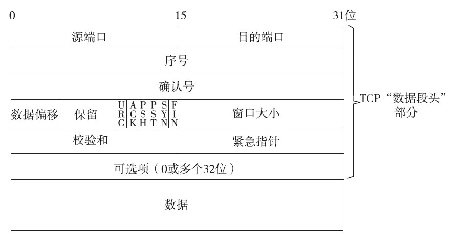
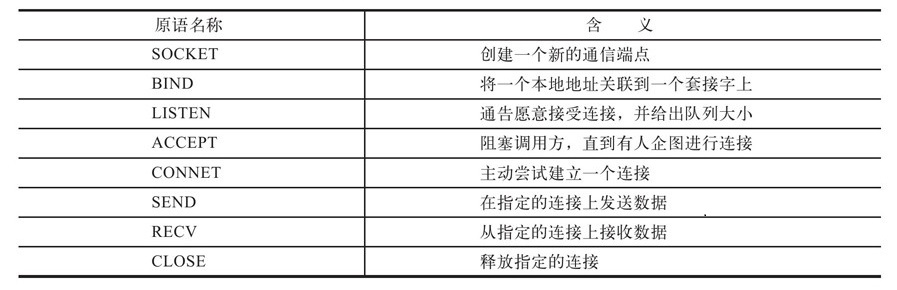
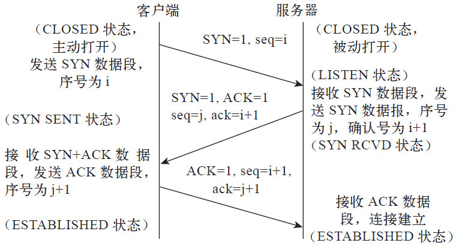
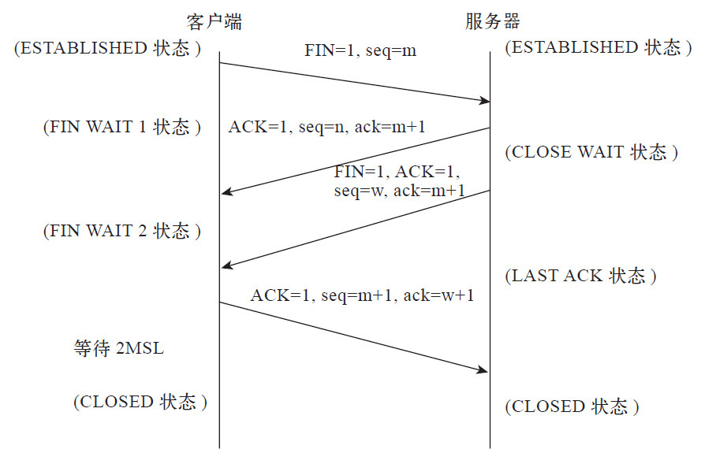

# TCP 基础

### TCP 数据段格式

TCP 通过数据段的交互来建立连接、传输数据、发出确认、进行差错控制、流量控制及关闭连接。整个 TCP 数据段也分为“数据段头”和“数据”两部分（这也是绝大多数报文封装的方式），所谓“数据段头”就是 TCP 为了实现端到端可靠传输而加上的 TCP 控制信息，而“数据”部分则是指由高层（即 TCP/IP 体系结构中的“应用层”）来的用户数据。TCP 数据段格式如下：

部分字段的描述：

-   序号(Acknowlegment Number)：序号指 TCP 数据段中的“数据”部分的第一个字节的编号，占 32 位。例如，一个数据段的“序号”字段值是 101，而该数字段中共有 100 字节，表明本数据段的最后一个字节的编号是 200。
-   确认号(Acknowlegment Number，ack):确认号指期望接收到对方下一个数据段中“数据”部分的第一个字节序号，占 32 位。例如，主机 B 已收到主机 A 发来的一个数据段，其序号值是 101，而该数据段的长度是 100 字节。这表明主机 B 已收到主机 A 前 200 个字节，下一个期望要收到的数据段的第一个字节的序号应该是 201，于是主机 B 在给主机 A 发送确认数据段时要把“确认号”设置为 201。
-   ACK:Acknowledgement（确认）控制位，指示 TCP 数据段中的“确认号”字段是否有效，占 1 位。仅当 ACK 位置 1 时才表示“确认号”字段有效，否则表示“确认号”字段无效。
-   SYN:Synchronization（同步）控制位，用来在传输连接建立时同步传输连接序号，占 1 位。当 SYN 位置 1 时，表示这是一个连接请求或连接确认报文。当 SYN=1，而 ACK=0 时，表明这是一个连接请求数据段。如果对方同意建立连接，则对方会返回一个 SYN=1、ACK=1 的确认报文。
-   FIN:Final（最后）控制位，用于释放一个传输连接，占 1 位。当 FIN 位置 1 时，表示数据已全部传输完成，发送端没有数据要传输了，要求释放当前连接，但是接收端仍然可以继续接收还没有接收完的数据。

### Socket 原语

### 三次握手

TCP 是面向连接的传输层协议，提供可靠的传输服务。为了准确无误地把数据送达目标处，TCP 协议采用了三次握手策略。用 TCP 协议把数据段送出去后，TCP 不会对传送 后的情况置之不理，它一定会向对方确认是否成功送达。握手过程中使用了 TCP 的标志：SYN 和 ACK。

TCP 建立过程如下：

-   客户端发送带 SYN 标志的数据段给服务端
    -   seq=1 表示本次客户端向服务端发送的数据段序号为 i
-   服务端接收到 T 数据段后，向客户端返回带 SYN 、 ACK 和 ack 的 标志的数据段，以示传达确认信息
    -   SYN = 1 表示此为同步数据段;ACK = 1 表示此为确认数据段;ack（确认号）=i+1 表示期望接收到的下个数据段序号为 i+1、seq=j 表示本次客户端向服务端发送的数据段序号为 j
-   客户端再回传一个带 ACK 标志的数据段，代表“握手”结束
    -   ack =j+1 表示期望接收到的下个数据段序号为 j+1

### 四次挥手

相对 TCP 传输连接建立的三次握手过程来说，TCP 传输连接的释放过程要稍微复杂一些，需要经过四次握手过程。这是由 TCP 的半关闭（half-close）特性造成的，因为这一个 TCP 连接是全双工（即数据在两个方向上能同时传递），每个方向必须单独进行关闭。TCP 传输连接关闭的原则如下：当一端完成它的数据发送任务后就可以发送一个 FIN 字段置 1 的数据段来终止这个方向的数据发送；当另一端收到这个 FIN 数据段后，必须通知它的应用层“对端已经终止了那个方向的数据传送”。

TCP 释放过程如下：

-   主动关闭方发送一个 FIN，告诉被动关闭方：我已经不会再给你发数据了(当然，在 fin 包之前发送出去的数据，如果没有收到对应的 ack 确认报文，主动关闭方依然会重发这些数据)，但是，此时主动关闭方还可以接受数据
-   被动关闭方收到 FIN 包后，发送一个 ACK 给对方，确认序号为收到序号+1（与 SYN 相同，一个 FIN 占用一个序号）
-   被动关闭方发送一个 FIN，也就是告诉主动关闭方，我的数据也发送完了，不会再给你发数据了
-   主动关闭方收到 FIN 后，发送一个 ACK 给被动关闭方，确认序号为收到序号+1，至此，完成四次挥手

### 滑动窗口

### 超时重传

检测丢失片段并对之重传的方法概念上是很简单的。每一次发送一个片段，就开启一个重传计时器。计时器有一个初始值并随时间递减。如果在片段接收到确认之前计时器超时，就重传片段。TCP 使用了这一基本技术，但实现方式稍有不同。原因在于为了提高效率需要一次处理多个未被确认的片段，以保证每一个在恰当的时间重传。TCP 按照以下特定顺序工作：
**放置于重传队列中，计时器开始** 包含数据的片段一经发送，片段的一份复制就放在名为重传队列的数据结构中，此时启动重传计时器。因此，在某些时间点，每一个片段都会放在队列里。队列按照重传计时器的剩余时间来排列，因此 TCP 软件可追踪那几个计时器在最短时间内超时。
**确认处理** 如果在计时器超时之前收到了确认信息，则该片段从重传队列中移除。
**重传超时** 如果在计时器超时之前没有收到确认信息，则发生重传超时，片段自动重传。当然，相比于原片段，对于重传片段并没有更多的保障机制。因此，重传之后该片段还是保留在重传队列里。重传计时器被重启，重新开始倒计时。如果重传之后没有收到确认，则片段会再次重传并重复这一过程。在某些情况下重传也会失败。我们不想要 TCP 永远重传下去，因此 TCP 只会重传一定数量的次数，并判断出现故障终止连接。

### 拥塞控制

参考：
https://wizardforcel.gitbooks.io/network-basic/0.html
